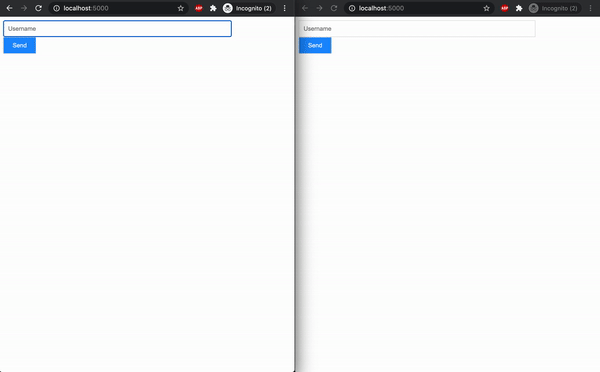

# Chat Without Websocket (Chat WoWS)

## Description

To enable two-way chat without websocket, will be using HTTP POST and
Server Sent Event (SSE) instead.

- Send message with HTTP POST
- Receive message through SSE with EventSouce API

## Development Setup

- Python 3.7
- Install pipenv: `pip3 install pipenv`
- Install dependencies: `pipenv install`
- Redis server
  - via docker: `docker run --rm --name temp-redis -p 6379:6379 -d redis`

## Usage

```shell script
gunicorn app:app --worker-class gevent --bind 127.0.0.1:5000
```

Then, visit `localhost:5000` from browser and follow as example below


